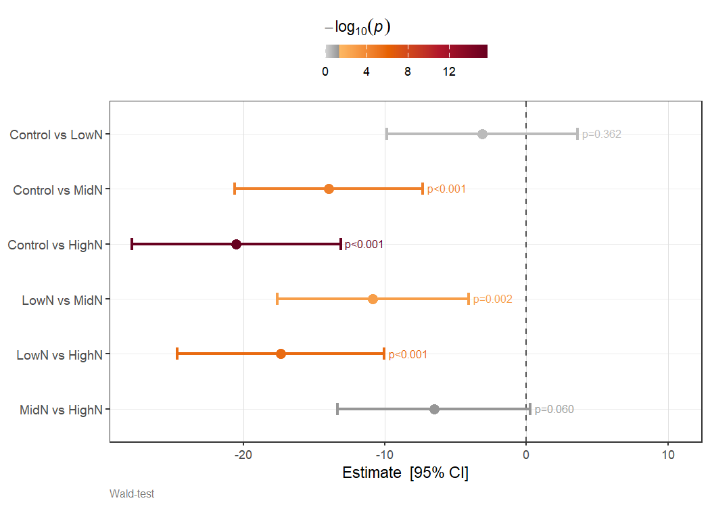
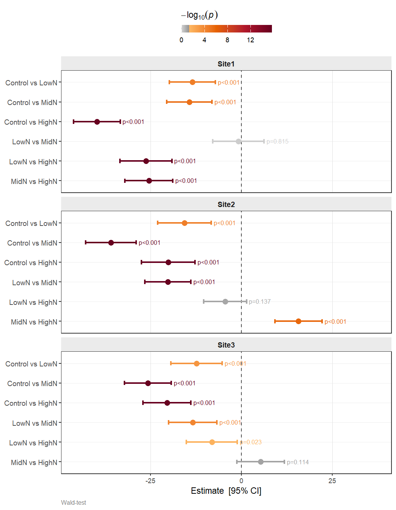
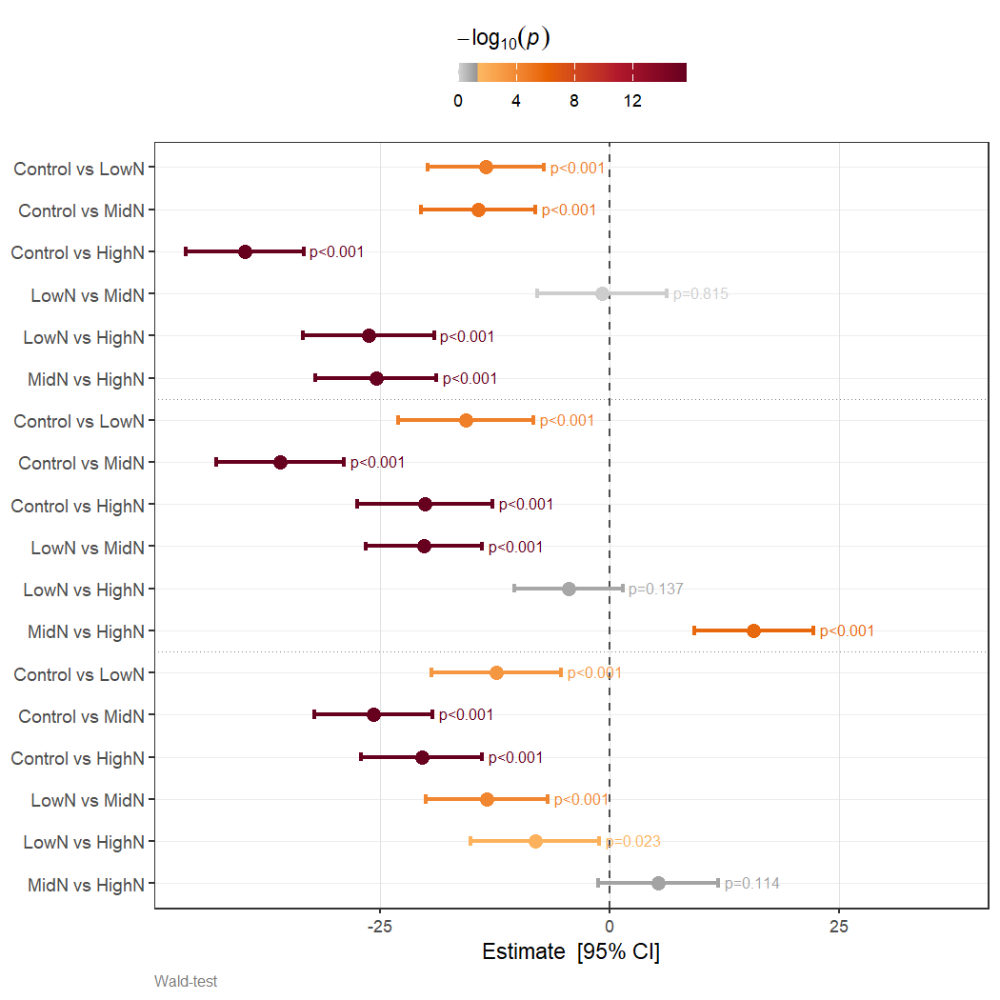
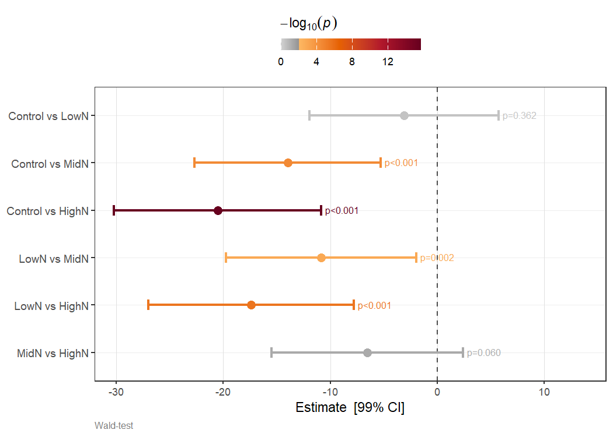
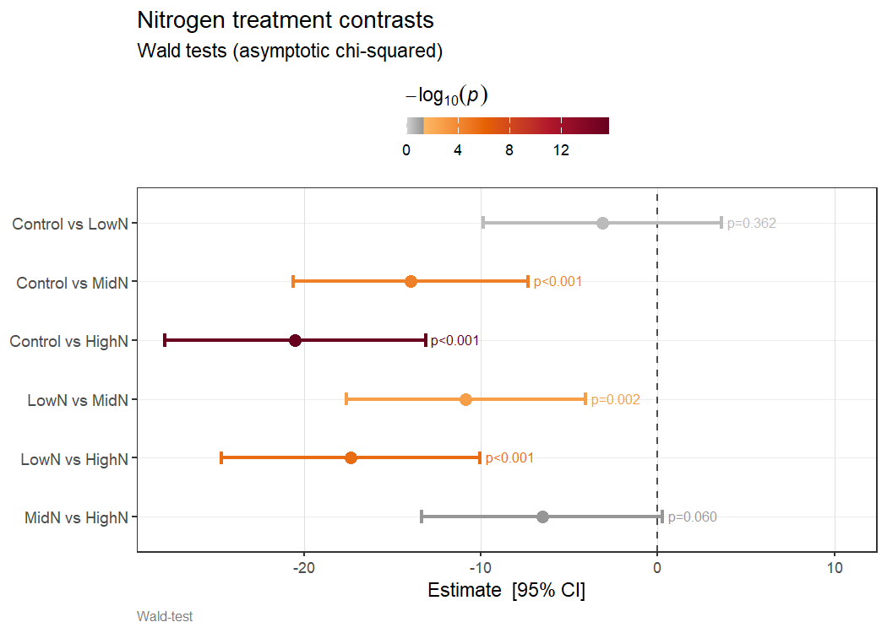

Wald Tests on Fixed-Effect Contrasts
================

- [Overview](#overview)
- [Mathematical Framework](#mathematical-framework)
  - [Predicted values and their
    variance](#predicted-values-and-their-variance)
  - [Contrast tests](#contrast-tests)
  - [Joint zero tests](#joint-zero-tests)
  - [P-value adjustment](#p-value-adjustment)
- [Setup](#setup)
  - [Simulated data — four nitrogen
    treatments](#simulated-data--four-nitrogen-treatments)
- [Example 1: Pairwise contrasts](#example-1-pairwise-contrasts)
- [Example 2: Manual contrast vector](#example-2-manual-contrast-vector)
- [Example 3: Custom contrast matrix](#example-3-custom-contrast-matrix)
- [Example 4: Joint zero test](#example-4-joint-zero-test)
- [Example 5: Combining contrast and zero
  tests](#example-5-combining-contrast-and-zero-tests)
- [Example 6: By-group testing](#example-6-by-group-testing)
  - [Multi-factor `by`](#multi-factor-by)
- [Example 7: F-tests](#example-7-f-tests)
- [Example 8: P-value adjustment](#example-8-p-value-adjustment)
- [Forest plots with
  `plot_waldTest()`](#forest-plots-with-plot_waldtest)
  - [Basic forest plot](#basic-forest-plot)
  - [By-group with faceting
    (`facet = TRUE`)](#by-group-with-faceting-facet--true)
  - [By-group on one panel
    (`facet = FALSE`)](#by-group-on-one-panel-facet--false)
  - [Adjusting the CI level and significance
    threshold](#adjusting-the-ci-level-and-significance-threshold)
  - [Extracting the plot data](#extracting-the-plot-data)
- [ASReml-R V4 integration](#asreml-r-v4-integration)
- [Summary](#summary)
- [References](#references)

------------------------------------------------------------------------

## Overview

`waldTest()` performs **Wald tests on linear contrasts of predicted
values** obtained from `predict()`. Because it works entirely from a
prediction list (predicted values + prediction error variance–covariance
matrix), it requires no access to model internals and works with any
mixed-model software that exposes a `vcov`-style prediction object —
including ASReml-R V4.

Two complementary test types are available:

| Type                  | Null hypothesis                                       | Use case                                           |
|-----------------------|-------------------------------------------------------|----------------------------------------------------|
| `"con"` — contrast    | $H_0: \mathbf{c}^\top\hat{\boldsymbol{\tau}} = 0$     | Pairwise, treatment vs control, custom comparisons |
| `"zero"` — joint zero | $H_0: \mathbf{Z}\hat{\boldsymbol{\tau}} = \mathbf{0}$ | Are a set of effects simultaneously zero?          |

The companion function `plot_waldTest()` produces a publication-ready
forest plot directly from the result.

------------------------------------------------------------------------

## Mathematical Framework

### Predicted values and their variance

Let
$\hat{\boldsymbol{\tau}} = (\hat{\tau}_1, \ldots, \hat{\tau}_n)^\top$ be
the vector of $n$ predicted (BLUEs or BLUPs) treatment effects, obtained
from a mixed model with prediction error variance–covariance matrix

$$
\text{Var}(\hat{\boldsymbol{\tau}} - \boldsymbol{\tau}) = \mathbf{V}_{\hat{\tau}}.
$$

In ASReml-R V4 this is returned by
`predict(model, classify = ..., vcov = TRUE)$vcov`.

------------------------------------------------------------------------

### Contrast tests

A **contrast** is a linear combination
$c = \mathbf{c}^\top\hat{\boldsymbol{\tau}}$ where $\mathbf{c}$ is a
real-valued vector (not required to sum to zero in general, though
pairwise differences do). The null hypothesis is

$$
H_0: \mathbf{c}^\top\boldsymbol{\tau} = 0.
$$

The estimated contrast and its standard error are

$$
\hat{c} = \mathbf{c}^\top\hat{\boldsymbol{\tau}}, \qquad
\text{SE}(\hat{c}) = \sqrt{\mathbf{c}^\top \mathbf{V}_{\hat{\tau}} \mathbf{c}}.
$$

The **Wald statistic** is

$$
W = \frac{\hat{c}^2}{\mathbf{c}^\top \mathbf{V}_{\hat{\tau}} \mathbf{c}}
    = \frac{(\mathbf{c}^\top\hat{\boldsymbol{\tau}})^2}
           {\mathbf{c}^\top \mathbf{V}_{\hat{\tau}} \mathbf{c}}
    \;\overset{H_0}{\sim}\; \chi^2_1.
$$

When an error degrees of freedom $\nu$ is available (e.g. from a mixed
model), the **F-statistic** $F = W / 1$ is referred to an $F_{1,\nu}$
distribution, providing better finite-sample calibration.

#### Pairwise contrasts

For $k$ treatment levels the $\binom{k}{2}$ pairwise differences are a
convenient special case. For levels $i$ and $j$, the contrast vector
$\mathbf{c}_{ij}$ has $+1$ in position $i$, $-1$ in position $j$, and
zeros elsewhere, so

$$
\hat{c}_{ij} = \hat{\tau}_i - \hat{\tau}_j, \qquad
\text{Var}(\hat{c}_{ij}) = V_{ii} - 2V_{ij} + V_{jj}.
$$

Setting `comp = "pairwise"` in `waldTest()` generates all $\binom{k}{2}$
contrasts automatically.

#### Custom contrast matrices

Multiple contrasts can be tested in a single call by supplying a
contrast **matrix** $\mathbf{C}$ (rows = contrasts, columns = levels).
Each row is tested independently:

$$
W_r = \frac{(\mathbf{c}_r^\top\hat{\boldsymbol{\tau}})^2}
           {\mathbf{c}_r^\top \mathbf{V}_{\hat{\tau}} \mathbf{c}_r}, \quad r = 1, \ldots, m.
$$

------------------------------------------------------------------------

### Joint zero tests

A **joint zero test** simultaneously tests whether a subset of $q$
effects are all zero. Define the selection matrix $\mathbf{Z}$
($q \times n$) with a single $1$ per row selecting the coefficients of
interest. The null hypothesis is

$$
H_0: \mathbf{Z}\boldsymbol{\tau} = \mathbf{0}.
$$

The Wald statistic is

$$
W = \hat{\boldsymbol{\tau}}^\top \mathbf{Z}^\top
    \bigl(\mathbf{Z}\,\mathbf{V}_{\hat{\tau}}\,\mathbf{Z}^\top\bigr)^{-1}
    \mathbf{Z}\hat{\boldsymbol{\tau}}
    \;\overset{H_0}{\sim}\; \chi^2_q,
$$

or $F = W / q \sim F_{q,\nu}$ for the F-test form.

------------------------------------------------------------------------

### P-value adjustment

When many contrasts are tested the family-wise error rate (FWER) or
false discovery rate (FDR) inflates. `waldTest()` passes all raw
p-values within each group to `p.adjust()`. The key options are:

| Method           | Controls                   | Best used when                             |
|------------------|----------------------------|--------------------------------------------|
| `"none"`         | —                          | Exploratory or single contrast             |
| `"bonferroni"`   | FWER (conservative)        | Few contrasts, strict control needed       |
| `"holm"`         | FWER (less conservative)   | Few to moderate contrasts                  |
| `"fdr"` / `"BH"` | FDR                        | Many contrasts, some true effects expected |
| `"BY"`           | FDR (arbitrary dependence) | Dependent test statistics                  |

------------------------------------------------------------------------

## Setup

``` r
library(biomAid)
library(ggplot2)
```

### Simulated data — four nitrogen treatments

We simulate a prediction object for four nitrogen treatments with a
known increasing yield response. This mirrors the structure returned by
`predict(model, classify = "Treatment", vcov = TRUE)` from ASReml-R V4.

``` r
set.seed(42L)

treatments <- c("Control", "LowN", "MidN", "HighN")
n          <- length(treatments)
mu         <- c(45, 52, 61, 67)          # known increasing trend

# Predicted values data frame
pv <- data.frame(
  Treatment       = factor(treatments, levels = treatments),
  predicted.value = mu + stats::rnorm(n, 0, 2),
  std.error       = stats::runif(n, 1.5, 3.5),
  status          = factor(rep("Estimable", n)),
  stringsAsFactors = FALSE
)

# Prediction error variance–covariance matrix
A    <- matrix(stats::rnorm(n^2, 0, 0.4), n, n)
vcov <- crossprod(A) + diag(c(4, 5, 5, 6))

pred <- list(pvals = pv, vcov = vcov)
```

The predicted values and their standard errors:

``` r
pv[, c("Treatment", "predicted.value", "std.error")]
#>   Treatment predicted.value std.error
#> 1   Control        47.74192  2.813985
#> 2      LowN        50.87060  2.910130
#> 3      MidN        61.72626  2.415484
#> 4     HighN        68.26573  2.938225
```

------------------------------------------------------------------------

## Example 1: Pairwise contrasts

The most common use case — test all $\binom{4}{2} = 6$ pairwise
differences among the nitrogen treatments. Setting `comp = "pairwise"`
generates the contrast matrix automatically.

``` r
res1 <- waldTest(
  pred,
  cc = list(
    list(coef = treatments, type = "con", comp = "pairwise")
  )
)

res1$Contrasts
#>         Comparison   Estimate Std.Error Wald.Statistic df  P.Value
#> 1  Control vs LowN  -3.128687  3.432074       0.831019  1 0.361978
#> 2  Control vs MidN -13.984340  3.382759      17.089991  1 0.000036
#> 3 Control vs HighN -20.523808  3.762537      29.754616  1 0.000000
#> 4     LowN vs MidN -10.855653  3.444802       9.930779  1 0.001625
#> 5    LowN vs HighN -17.395122  3.733963      21.702757  1 0.000003
#> 6    MidN vs HighN  -6.539468  3.471193       3.549174  1 0.059575
```

`Comparison` is `"A vs B"` where `A` carries the positive coefficient
(i.e. A − B). The `Wald.Statistic` is
$W = \hat{c}^2 / \widehat{\text{Var}}(\hat{c})$; `df = 1` for all
single-contrast rows; `P.Value` is from $\chi^2_1$.

The `HighN vs Control` contrast should be the most significant,
reflecting the largest mean difference in the simulated data.

------------------------------------------------------------------------

## Example 2: Manual contrast vector

A **manual contrast** lets you specify exactly which comparison to make
and how to label it. Here we test HighN minus Control using
`comp = c(-1, 0, 0, 1)` (one element per level in `coef` order).

``` r
res2 <- waldTest(
  pred,
  cc = list(
    list(
      coef  = treatments,          # all 4 levels in order
      type  = "con",
      comp  = c(-1, 0, 0, 1),     # HighN - Control
      group = list(left = "HighN", right = "Control")
    )
  )
)

res2$Contrasts
#>         Comparison Estimate Std.Error Wald.Statistic df P.Value
#> 1 HighN vs Control 20.52381  3.762537       29.75462  1       0
```

The `group` argument overrides the auto-generated label so the output
reads `"HighN vs Control"` rather than the default position-based name.

------------------------------------------------------------------------

## Example 3: Custom contrast matrix

A contrast **matrix** (rows = contrasts, columns = levels) tests
multiple specific comparisons in one call. Here we test three
polynomial-style contrasts — linear, quadratic, and cubic trend — across
the equally-spaced nitrogen levels.

``` r
# Orthogonal polynomial contrasts for 4 equally-spaced levels
# (scaled for clarity; not required to be orthonormal)
C_poly <- matrix(
  c(-3, -1,  1,  3,   # linear trend
     1, -1, -1,  1,   # quadratic trend
    -1,  3, -3,  1),  # cubic trend
  nrow = 3, byrow = TRUE
)

res3 <- waldTest(
  pred,
  cc = list(
    list(
      coef  = treatments,
      type  = "con",
      comp  = C_poly,
      group = list(left  = c("Linear", "Quadratic", "Cubic"),
                   right = c("trend", "trend", "trend"))
    )
  )
)

res3$Contrasts
#>           Comparison   Estimate Std.Error Wald.Statistic df  P.Value
#> 1    Linear vs trend  72.427078 11.997854      36.441380  1 0.000000
#> 2 Quadratic vs trend   3.410782  4.815652       0.501646  1 0.478778
#> 3     Cubic vs trend -12.043151 10.783552       1.247259  1 0.264077
```

For a monotone nitrogen response we expect a strong **linear trend** and
negligible quadratic or cubic components.

------------------------------------------------------------------------

## Example 4: Joint zero test

A joint zero test asks: *are these effects simultaneously equal to
zero?* This uses `type = "zero"` and tests the $q$-dimensional null
$H_0: \mathbf{Z}\boldsymbol{\tau} = \mathbf{0}$.

Here we test whether the three non-Control treatment effects are jointly
zero — i.e. does nitrogen application have any effect at all?

``` r
res4 <- waldTest(
  pred,
  cc = list(
    list(
      coef  = c("LowN", "MidN", "HighN"),
      type  = "zero",
      group = "Nitrogen joint zero"
    )
  )
)

res4$Zero
#>                  Test Wald.Statistic df P.Value
#> 1 Nitrogen joint zero       1405.649  3       0
```

`df = 3` because three effects are tested simultaneously. The statistic
follows $\chi^2_3$ under $H_0$.

------------------------------------------------------------------------

## Example 5: Combining contrast and zero tests

Both test types can be combined in a single `cc` list. Results are
returned in separate `$Contrasts` and `$Zero` slots.

``` r
res5 <- waldTest(
  pred,
  cc = list(
    list(coef = treatments, type = "con", comp = "pairwise"),
    list(coef = c("LowN", "MidN", "HighN"), type = "zero",
         group = "Nitrogen joint zero")
  )
)

cat("--- Contrasts ---\n")
#> --- Contrasts ---
res5$Contrasts
#>         Comparison   Estimate Std.Error Wald.Statistic df  P.Value
#> 1  Control vs LowN  -3.128687  3.432074       0.831019  1 0.361978
#> 2  Control vs MidN -13.984340  3.382759      17.089991  1 0.000036
#> 3 Control vs HighN -20.523808  3.762537      29.754616  1 0.000000
#> 4     LowN vs MidN -10.855653  3.444802       9.930779  1 0.001625
#> 5    LowN vs HighN -17.395122  3.733963      21.702757  1 0.000003
#> 6    MidN vs HighN  -6.539468  3.471193       3.549174  1 0.059575

cat("\n--- Zero test ---\n")
#> 
#> --- Zero test ---
res5$Zero
#>                  Test Wald.Statistic df P.Value
#> 1 Nitrogen joint zero       1405.649  3       0
```

------------------------------------------------------------------------

## Example 6: By-group testing

When predictions span multiple environments or groups (e.g. a
`Treatment:Site` classify), the `by` argument runs the same `cc`
specification independently within each group. The grouping column is
prepended to both output tables.

``` r
set.seed(123L)
sites <- c("Site1", "Site2", "Site3")

make_site_pv <- function(site, seed) {
  set.seed(seed)
  data.frame(
    Treatment       = factor(treatments, levels = treatments),
    Site            = factor(site),
    predicted.value = mu + stats::rnorm(n, 0, 8),
    std.error       = stats::runif(n, 1.5, 4.0),
    status          = factor(rep("Estimable", n)),
    stringsAsFactors = FALSE
  )
}

all_pv <- do.call(rbind, mapply(make_site_pv, sites, c(1L, 2L, 3L),
                                SIMPLIFY = FALSE))
n_tot  <- nrow(all_pv)

# Block-diagonal vcov — sites are independent
vcov3 <- matrix(0, n_tot, n_tot)
for (i in seq_along(sites)) {
  idx <- ((i - 1L) * n + 1L):(i * n)
  set.seed(i * 10L)
  Ai  <- matrix(stats::rnorm(n^2, 0, 0.4), n, n)
  vcov3[idx, idx] <- crossprod(Ai) + diag(stats::runif(n, 3, 7))
}

pred3 <- list(pvals = all_pv, vcov = vcov3)
```

``` r
res6 <- waldTest(
  pred3,
  cc = list(
    list(coef = treatments, type = "con", comp = "pairwise")
  ),
  by = "Site"
)

res6$Contrasts
#>     Site       Comparison   Estimate Std.Error Wald.Statistic df  P.Value
#> 1  Site1  Control vs LowN -13.480777  3.218163      17.547438  1 0.000028
#> 2  Site1  Control vs MidN -14.326602  3.174292      20.370079  1 0.000006
#> 3  Site1 Control vs HighN -39.773877  3.269625     147.978968  1 0.000000
#> 4  Site1     LowN vs MidN  -0.845825  3.605754       0.055026  1 0.814538
#> 5  Site1    LowN vs HighN -26.293100  3.651546      51.847773  1 0.000000
#> 6  Site1    MidN vs HighN -25.447275  3.365917      57.157842  1 0.000000
#> 7  Site2  Control vs LowN -15.654110  3.773584      17.208724  1 0.000033
#> 8  Site2  Control vs MidN -35.878079  3.542470     102.576057  1 0.000000
#> 9  Site2 Control vs HighN -20.132311  3.769687      28.521777  1 0.000000
#> 10 Site2     LowN vs MidN -20.223969  3.223612      39.359280  1 0.000000
#> 11 Site2    LowN vs HighN  -4.478201  3.011543       2.211205  1 0.137012
#> 12 Site2    MidN vs HighN  15.745768  3.299688      22.770998  1 0.000002
#> 13 Site3  Control vs LowN -12.355262  3.590364      11.842051  1 0.000579
#> 14 Site3  Control vs MidN -25.765773  3.295750      61.119206  1 0.000000
#> 15 Site3 Control vs HighN -20.478412  3.345789      37.462380  1 0.000000
#> 16 Site3     LowN vs MidN -13.410512  3.393924      15.613004  1 0.000078
#> 17 Site3    LowN vs HighN  -8.123151  3.563535       5.196213  1 0.022636
#> 18 Site3    MidN vs HighN   5.287361  3.341984       2.503047  1 0.113626
```

The `Site` column identifies which group each contrast belongs to.
`coef` labels always refer to **within-group** row positions.

### Multi-factor `by`

When predictions cross two or more factors (e.g. `Treatment:Site:Year`),
pass a character vector to `by`. The levels are pasted into a composite
key and the output column is named accordingly:

``` r
# Illustrative only — would require a Treatment:Site:Year classify
res_sy <- waldTest(
  pred_site_year,
  cc = list(list(coef = treatments, type = "con", comp = "pairwise")),
  by = c("Site", "Year")
)
# Output column named "Site:Year"
```

------------------------------------------------------------------------

## Example 7: F-tests

When an error degrees of freedom $\nu$ is available (e.g. `model$nedf`
from ASReml-R), replacing the asymptotic $\chi^2$ with an $F_{1,\nu}$
distribution gives better-calibrated p-values in small samples. Set
`test = "F"` and supply `df_error`.

``` r
# Simulate a realistic denominator df (e.g. from a field trial model)
df_error_sim <- 54L

res7 <- waldTest(
  pred,
  cc     = list(list(coef = treatments, type = "con", comp = "pairwise")),
  test   = "F",
  df_error = df_error_sim
)

res7$Contrasts
#>         Comparison   Estimate Std.Error F.Statistic df  P.Value
#> 1  Control vs LowN  -3.128687  3.432074    0.831019  1 0.366030
#> 2  Control vs MidN -13.984340  3.382759   17.089991  1 0.000125
#> 3 Control vs HighN -20.523808  3.762537   29.754616  1 0.000001
#> 4     LowN vs MidN -10.855653  3.444802    9.930779  1 0.002651
#> 5    LowN vs HighN -17.395122  3.733963   21.702757  1 0.000021
#> 6    MidN vs HighN  -6.539468  3.471193    3.549174  1 0.064964
```

The column is now `F.Statistic` (= Wald / 1 for single contrasts).
P-values are from $F_{1,54}$ rather than $\chi^2_1$ — slightly larger in
small samples.

------------------------------------------------------------------------

## Example 8: P-value adjustment

With $\binom{4}{2} = 6$ pairwise comparisons the chance of at least one
false positive is inflated. The `adjust` argument applies `p.adjust()`
across all contrasts within each group.

``` r
# Bonferroni
res_bon <- waldTest(pred,
                    cc     = list(list(coef = treatments, type = "con",
                                       comp = "pairwise")),
                    adjust = "bonferroni")

# FDR (Benjamini–Hochberg)
res_fdr <- waldTest(pred,
                    cc     = list(list(coef = treatments, type = "con",
                                       comp = "pairwise")),
                    adjust = "fdr")

cat("--- Bonferroni adjusted ---\n")
#> --- Bonferroni adjusted ---
res_bon$Contrasts[, c("Comparison", "P.Value")]
#>         Comparison  P.Value
#> 1  Control vs LowN 1.000000
#> 2  Control vs MidN 0.000214
#> 3 Control vs HighN 0.000000
#> 4     LowN vs MidN 0.009752
#> 5    LowN vs HighN 0.000019
#> 6    MidN vs HighN 0.357450

cat("\n--- FDR (BH) adjusted ---\n")
#> 
#> --- FDR (BH) adjusted ---
res_fdr$Contrasts[, c("Comparison", "P.Value")]
#>         Comparison  P.Value
#> 1  Control vs LowN 0.361978
#> 2  Control vs MidN 0.000071
#> 3 Control vs HighN 0.000000
#> 4     LowN vs MidN 0.002438
#> 5    LowN vs HighN 0.000010
#> 6    MidN vs HighN 0.071490
```

Bonferroni multiplies each p-value by the number of tests (capped at 1);
FDR is less conservative and generally preferred when many contrasts are
tested and some true effects are expected.

------------------------------------------------------------------------

## Forest plots with `plot_waldTest()`

`plot_waldTest()` turns a `waldTest()` result directly into a forest
plot. Each contrast is shown as a filled circle with horizontal
confidence interval bars. Points are coloured by $-\log_{10}(p)$:
non-significant results appear in grey; significant results follow a
warm gradient from gold through orange to dark red as evidence
strengthens. The raw p-value is printed beside each row.

### Basic forest plot

``` r
p1 <- plot_waldTest(res1)
print(p1)
```



The vertical dashed line at $x = 0$ is the reference for no difference.
The colour bar at the top maps $-\log_{10}(p)$ — values to the right of
the grey zone are significant at `alpha = 0.05`.

### By-group with faceting (`facet = TRUE`)

When `waldTest()` was called with `by`, `facet = TRUE` (the default)
produces one panel per group with free y-scales, making it easy to
compare effect sizes across environments.

``` r
p_facet <- plot_waldTest(res6, facet = TRUE)
print(p_facet)
```



### By-group on one panel (`facet = FALSE`)

`facet = FALSE` places all groups on a single panel with dotted
horizontal separator lines between groups. Useful for compact
side-by-side comparison when the number of contrasts per group is small.

``` r
p_single <- plot_waldTest(res6, facet = FALSE)
print(p_single)
```



### Adjusting the CI level and significance threshold

`ci_level` controls the width of the CI arms; `alpha` shifts the
colour-scale break between grey (non-significant) and the warm gradient.

``` r
# 99% CI arms; significance threshold at alpha = 0.01
p_99 <- plot_waldTest(res1, ci_level = 0.99, alpha = 0.01)
print(p_99)
```



### Extracting the plot data

`return_data = TRUE` returns the tidy data frame used internally to
build the plot, giving full control for bespoke customisation.

``` r
df <- plot_waldTest(res1, return_data = TRUE)
df[, c("label", "Estimate", "CI_lower", "CI_upper", "P.Value",
       "neg_log10_p", "significant", "p_label")]
#>              label   Estimate   CI_lower    CI_upper  P.Value neg_log10_p
#> 1  Control vs LowN  -3.128687  -9.855428   3.5980544 0.361978   0.4413178
#> 2  Control vs MidN -13.984340 -20.614426  -7.3542542 0.000036   4.4436975
#> 3 Control vs HighN -20.523808 -27.898245 -13.1493710 0.000000  15.6535598
#> 4     LowN vs MidN -10.855653 -17.607341  -4.1039651 0.001625   2.7891466
#> 5    LowN vs HighN -17.395122 -24.713555 -10.0766890 0.000003   5.5228787
#> 6    MidN vs HighN  -6.539468 -13.342881   0.2639453 0.059575   1.2249359
#>   significant p_label
#> 1       FALSE p=0.362
#> 2        TRUE p<0.001
#> 3        TRUE p<0.001
#> 4        TRUE p=0.002
#> 5        TRUE p<0.001
#> 6       FALSE p=0.060
```

The data frame can be passed to any ggplot2 workflow. For example, to
add a custom annotation or change the colour scheme:

``` r
# Re-use the tidy data with a custom ggplot2 layer
p_custom <- plot_waldTest(res1) +
  ggplot2::ggtitle("Nitrogen treatment contrasts",
                   subtitle = "Wald tests (asymptotic chi-squared)")
print(p_custom)
```



------------------------------------------------------------------------

## ASReml-R V4 integration

In practice `waldTest()` is most commonly called via its S3 method
`waldTest.asreml()`, which calls `predict()` internally. The workflow
below requires an ASReml-R licence and is shown for reference only.

``` r
library(asreml)

# Fit a model
model <- asreml(
  yield ~ Treatment,
  random  = ~ Variety + Site + Site:Variety,
  data    = trial_data
)

# --- Option A: S3 convenience method ---
# predict() is called internally; df_error taken from model$nedf automatically
res_asr <- waldTest(
  model,
  classify = "Treatment",
  cc       = list(list(coef = c("Control", "LowN", "MidN", "HighN"),
                       type = "con", comp = "pairwise")),
  test     = "F",
  adjust   = "fdr"
)

# --- Option B: explicit predict() then waldTest() ---
pred_asr <- predict(model, classify = "Treatment:Site", vcov = TRUE)

res_by <- waldTest(
  pred_asr,
  cc       = list(list(coef = c("Control", "LowN", "MidN", "HighN"),
                       type = "con", comp = "pairwise")),
  by       = "Site",
  test     = "F",
  df_error = model$nedf,
  adjust   = "fdr"
)

# Forest plot
plot_waldTest(res_by, facet = TRUE)
```

------------------------------------------------------------------------

## Summary

| Task                     | `cc` specification                                         |
|--------------------------|------------------------------------------------------------|
| All pairwise differences | `list(coef = levs, type = "con", comp = "pairwise")`       |
| Single manual contrast   | `list(coef = levs, type = "con", comp = c(...))`           |
| Multiple contrasts       | `list(coef = levs, type = "con", comp = matrix(...))`      |
| Joint zero test          | `list(coef = levs, type = "zero", group = "label")`        |
| Both types               | Combine in the same `cc` list                              |
| By-group                 | Add `by = "ColumnName"` to `waldTest()`                    |
| F-test                   | Add `test = "F", df_error = model$nedf`                    |
| Adjust p-values          | Add `adjust = "fdr"` (or `"bonferroni"`, `"holm"`, `"BY"`) |
| Forest plot              | `plot_waldTest(res)`                                       |
| Export plot data         | `plot_waldTest(res, return_data = TRUE)`                   |

------------------------------------------------------------------------

## References

Wald, A. (1943). Tests of statistical hypotheses concerning several
parameters when the number of observations is large. *Transactions of
the American Mathematical Society*, **54**(3), 426–482.

Searle, S.R., Casella, G. & McCulloch, C.E. (1992). *Variance
Components*. Wiley.

Kenward, M.G. & Roger, J.H. (1997). Small sample inference for fixed
effects from restricted maximum likelihood. *Biometrics*, **53**(3),
983–997.

Benjamini, Y. & Hochberg, Y. (1995). Controlling the false discovery
rate: a practical and powerful approach to multiple testing. *Journal of
the Royal Statistical Society B*, **57**(1), 289–300.
